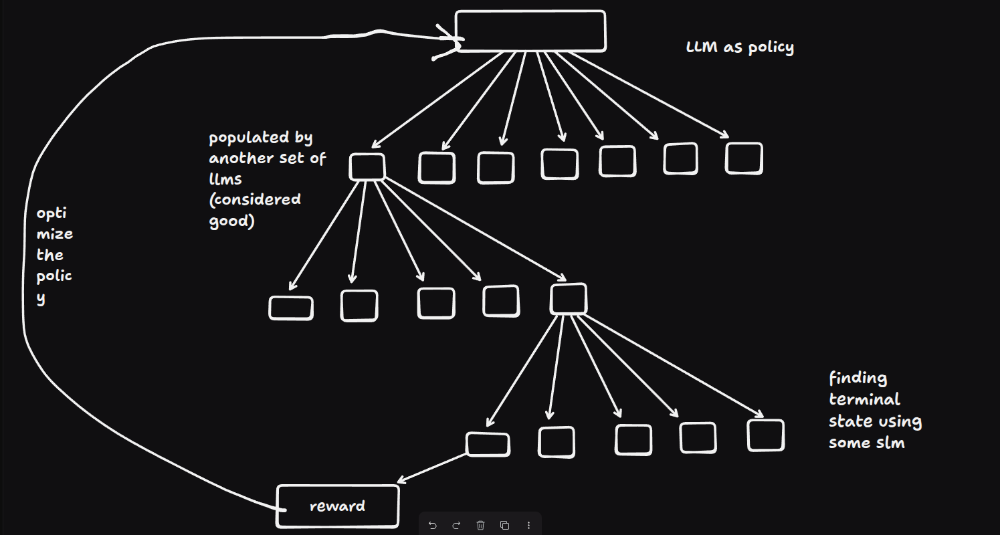
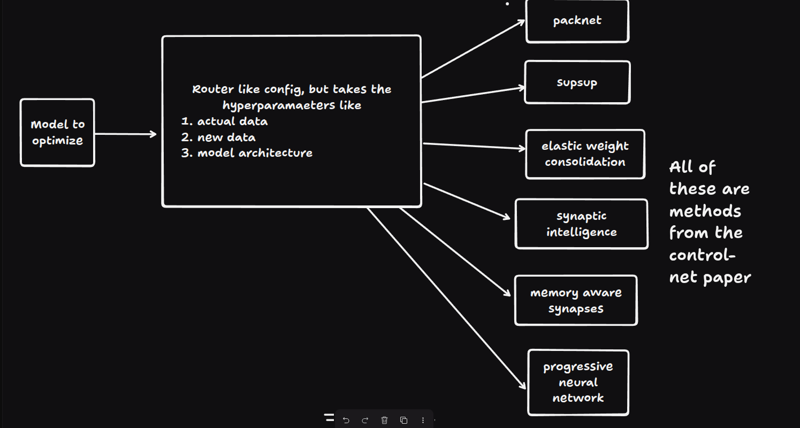

# My Architecture

So i have designed two systems more similar to waht i learn from this paper: https://discovery.ucl.ac.uk/id/eprint/10045895/1/agz_unformatted_nature.pdf

I want to create something similar to it, and i think these are the problems to tackle:
1. populting the search space
2. navigating through the state space with some score
3. finding the terminal state
4. proper reward system
5. if policy network is something we usually we use in alphazero like systems, or is it diff.

So I asked this questions myself and here's what i got:



## Addressing the issues
### 1. populting the search space
For the state space, we can take a bunch of good llms out there, and based on taokens generate before we just generate a single token afterwards, in the right direction say 50 and in the wrong direction 50. So this is done by a stack of 10 models, i have thought.

---
> Clarifying this idea is for the companies who have enough amount of capital, and acccess to their internal modes, and we can take good open soirce models like deepseek, qwen, gemma, llama if we want. As this can result in scaling issues, this step can be applied at the later stages of the training, even after the rlhf, rlaif, constituotional ai things.

> We can have a convention from now, like the **primary model** is our model, which we need to train, and the **teacher models** are the ones in the stack of 10 models.

---
### 2. navigating through the state space with some score
So these are just tokens generated and a context of tokens, we can take the new token from the primary as well as the teacher model, merge it with the predefined things, and then run some similarity algos like cosine similarity, and have a score, just like how mcts has the **ucb**(upper confidence bound) to navigate to the next leaf node.

With this score, we can select the next token, and just generate from there again. 

### 3. finding the terminal state
This is a tricky thing in nlp, as in games we can define this terminal state easily. But over here, its an open ended question, so for now let's just keep a system like a **Small Language Model** (ex: Gemma3 270m from unsloth), and then make it to take the decision. Before that we can filter it out by passing an intermediatory test like the token must be `{!, ., ?, and so on}`. And also generate a proxy generatin that the next token is more important or can we end here.

### 4. Proper Reward System
For this we can do something in the intermediatory steps, we can use perplexity rewards, accumulate them and at last, use a hard reward system with a bit llm reward system from the paper [lmgt](https://arxiv.org/pdf/2409.04744). 

### 5. policy network
As we know from the start of the assignment, we treat the llm as the policy, so the **primary model is our policy** over here.


## New Issues
1. Teacher bias
2. training the full llm
3. tackle choosing the wrong example leaf and then becoming confident - typically reward hacking
4. restricting to choose the wron leaves

### 1. Teacher Bias
For this same issue, i just proposed that there are stack of 10 models, and very diversified models, like from diff families.

### 2. training the full llm
For this, i'm thinking of using methods from the paper [**A continual learning survey:Defying forgetting in classification tasks**](http://qmro.qmul.ac.uk/xmlui/bitstream/handle/123456789/105625/Slabaugh%20A%20Continual%20Learning%202021%20Accepted.pdf?sequence=2&isAllowed=y), where therer are methods likes
1. elastic weight consolidation -> where in we classify importatn weights using the **fisher information matrix** and then freeze them
2. synaptic intelligence -> we classify the important weights and reezing them, but here we do the classification using the **how much the weight contributes to reducing loss** and not the fisher information matrix
3. pnn -> instead of overwrting old weights, pnns freeze old networks and introduce new columns(new layers) to handle new tasks, but this could exponentially increase
4. packnet -> reuses a fixed-size of models by carfully pruning and repurposing the wights for the new tasks.
5. supermasks in superposistion(supsup) -> using a fixed randomly initialized neural networks and learning only binary masks for each task.
and more methods were i dont remember

So can choose any idea listed and train them, or we can do something like this



---
## Training discussion
so we can use the new training data as a chunk of a refined dataset but let it be diverse like not only math specified, as in like if we get the reward negative, we can use a chunk of the large dataset feed it, rather than training is as a whole, as if it happens its no diff from sft, so we take a chunk train it and let it explore and then these steps repeats. This is hardly inspired from the paper [**SFT Memorizes, RL Generalizes**](https://arxiv.org/pdf/2501.17161).

---

### 3. tackle choosing the wrong example leaf and then becoming confident - typically reward hacking
So i thought over here that, for the model to explore first we'll keep the weights of all the initial nodes like with the same weightage
$$weightage=1/n$$
where n is the number of child for the particular parent in the tree.

So when we propogate through the reward, and it gets postiive like the reward has increased from the previous iteration, we can do something
```
if chosen wrong example child in any stage -> reduce the weightage of it
else if chosen right example child in any stage -> increase the weightage of it
```
So this way we can avoid the reward hacking and also the model will explore the nodes with more weightage.

like this weightage is just gonna be multplied with cosine similarity for the childs, from which we can get the **upper confidence bound**(as in like systems from AlphaZero).

### 4. restricting to choose the wron leaves
This i've discussed above itself.

so got this pain points : [Pain Points](./pain_points.md)

---
# Revised Architecture

> Instead of 10 models -> 3-5 diverse very good models
> 
> For the query we make the models answer the query with the most minimal steps by adding the system prompt accordingly, but i know this adds a overhead in the **prefilling stage**, we can consider for now and build the tree accordingly, like we populate the tree with child nodes like the tokens in the first place, like this we populate the tree first of all, and make our **primary model** choose the shortest path, as accumulating the perplexity intermediate awards, we also add the length of the path we took, and if its not the min path, with the right child chosen, we add the penalty accordingly.

---

But i'm actually compromising my initial idea tho, let's see. This is what im gonna propose. 

Yeah another thing the tree thing would cause me a compute overhead, only if i run models locally using **inference engines** like ollama, sglang, vllm, llama.cpp right. But i can write a backend or use the existing API provided by the respecitve providers, or unified providers like **open router**, this would only cause me latency, and if i use even better **amazon bedrock**, we can benefit even more with the latency as well, so this becomes even more valid now.

Or i can host my backend running efficient inference engine, that i'm planning to build actually [**FLuxLLM**](https://github.com/HyperKuvid-Labs/FluxLLM), host on bigger machines in aws with vertical scaling and assigning auto scaling groups. This devops side i can do actually comfortably. 

---
So no compromistion: **Generate** → **Evaluate** → **Choose Child** → **Repeat until Terminal State** → **Reward** → **Update the weightage in choosing the next nodes** → **Train the LLM** → **Repeat**

---

## Another potential Issue
Sp let's say a model is taking the path of a llm again and again which increases its weight, and it wil be more aligned to the particular LLM. This is addressed as a common issue in AlphaGO like systems -> **Exploration vs Exploitation**. 

So we need not increase the weightage of the nodes, instead we'll only decrease if it goes in the wrong direction, and increase it to align towards choosing the right path, like only in the path of the right side of tokens. 

---
Uaing **EOS TOKEN** from tne model itself to find the terminal states

---
