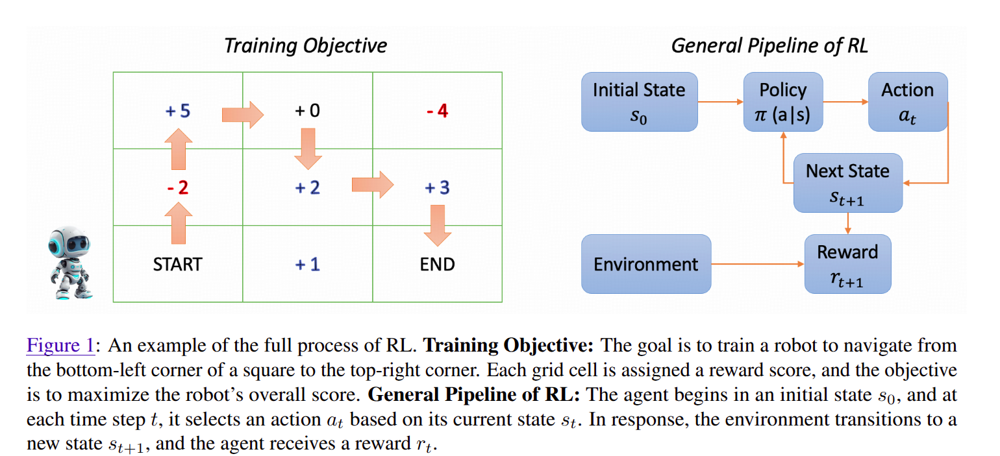
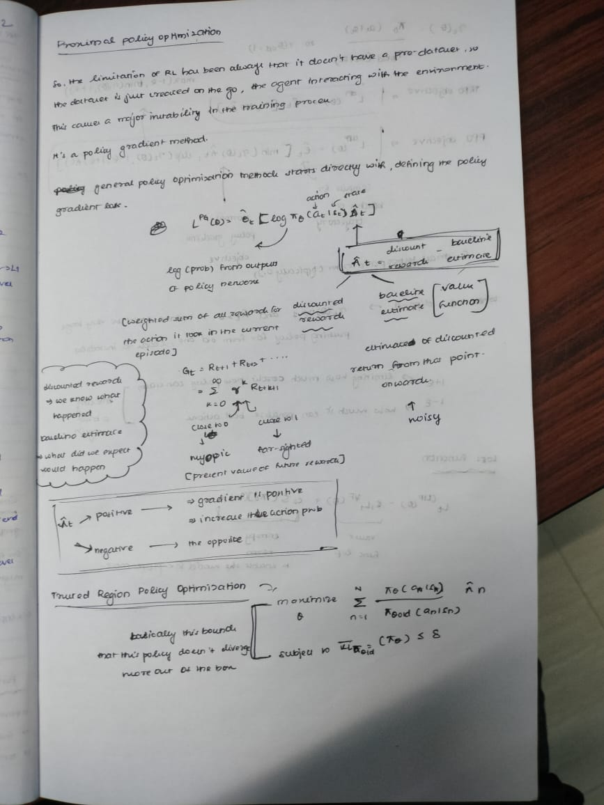
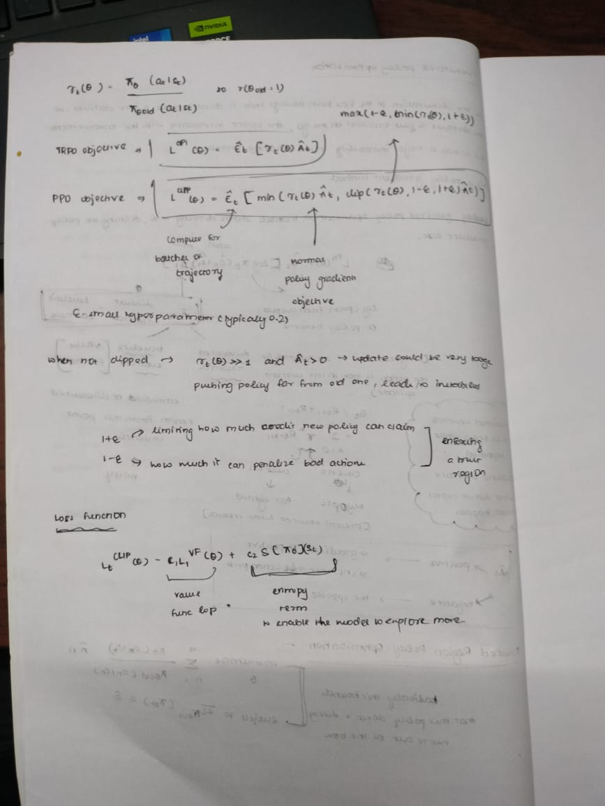

# REINFORCEMENT LEARNING ENHANCED LLMs: A SURVEY

Paper link: https://arxiv.org/pdf/2412.10400


This image represents the basics of rl explaining -> agent, environment, state, action, reward, policy.

And learned the apporach of how RL on LLMs works. 
There was a important point in the paper, actually chnaged my approach:
> "From the RL perspective, we can view the LLM itself as the policy"

so the current sequence generated is the state, the next token generated by the llm is the action, and reward is assessing the quality of the generated sequence, using a pretrained reward model. This is neatly represented in the image below from the paper:


Bruhh, this paper is exhaustive and pretty good. But it's very long, dunno how im gonna complete actually 😭.

### Deepseek-R1:
1. cold start sft (dataset: deepseek-v3 base, long-cot(chain of thought) dataset, high quality)
2. rl training (method: <b>Large-scale reasoning-focused RL</b>, checkpoint used to generate additional SFT data)
3. sft (dataset: reasoning data(generated using <b>rejection sampling</b> from rl checkpoints) + deepseek-v3(writing, factual-qa, self-cognition, translation, general ds of deepseek-v3))
4. final rl (align the model with human preferences)

---
I remember reading this particular paper: sft memorizes, rl generalizes. But don't remeber the concepts actually, will look into it later.

---

### Kimi-k1.5
1. pretraining
2. vanilla sft
3. long-cot sft
4. rl

so they came up with a rl prompt set to avoid reward hacking and overfitting to superficial patterns, these words are directly from the paper:
1. Diverse coverage, ensuring exposure to a broad range of reasoning challenges
2. Balanced difficulty, providing a mix of easy, moderate, and complex reasoning tasks
3. Accurate evaluability, allowing precise measurement of reasoning performance.

and another optimization they have done is regrading to cot
so they observed long-cot models reasoning is better, but they consume more test time tokens in the process. So they did this 4 steps
1. **Model Merging**: combine a long-CoT model with a shorter model by averaging their weights
2. **Shortest Rejection Sampling**: generate multiple responses using the long-CoT model and select the shortest correct response for SFT training
3. **Direct Preference Optimization (DPO)**: construct pairwise preference data, where shorter correct solutions are treated as positive samples and longer solutions as negative samples, optimize the model through DPO training
4. **Long2Short RL**: implement a two-phase RL training approach, where the model first undergoes standard RL training, and then a length penalty is applied, and the maximum response length is reduced, encouraging more concise reasoning while maintaining performance.

--- 
### Concepts to learn over here:

#### 1. Reward hacking
so basically these agents find a loop hole in the env and the reward function, so they are smart to maximize the rewards but not doing the tasks appropriately indeed.

so this coud potentially happen in our llm case:
Gao et al. (2022) characterized reward hacking through empirical scaling laws in RLHF contexts. They defined the KL divergence from the initial policy as:
$$d := \sqrt{D_{KL}(\pi \| \pi_{\text{init}})}$$

The gold reward $R^*$ follows the relationship:
$$R^*(d) = \alpha d - \beta d^2$$

However, proxy rewards $R^{\sim}$ systematically underestimate performance at higher KL divergences, growing approximately linearly with d rather than following the quadratic relationship. This mismatch creates the optimization gap that reward hacking exploits.

to avoid these there are methods:
1. Adversial reward functions: Treating the reward function as an adaptive adversarial agent that can adapt to discovered exploits.
2. Model Lookahead: Implementing reward mechanisms that consider future anticipated states, penalizing actions that would lead to reward function replacement.
3. Verifiable Rewards: Using binary ground truth signals $(R \in \{0,1\})$ that provide clear correctness criteria, making them robust against hacking due to their rule-based nature rather than learned approximations.

#### 2. Superficial patterns
superficial knowledge is characterized as knowledge that can be acquired through easily acquired token restyling patterns without affecting the model's ability to capture underlying causal relationships.

i like to put it this way indeed:
> We're trying to teach AI to be genuinely helpful and smart, but sometimes it just gets really, really good at looking helpful and smart instead. It's the digital equivalent of learning to dress for the job you want while completely forgetting to learn how to actually do that job!

#### 3. Direct Preference Optimization (DPO)
so looking at the words, i think it's something when we want a particular thing, we <b>maximize</b> the reward for it, and the opposite for the thing we don't want. I maybe think this is a good way to think about it, but i'm not sure.

so this seems to be a rival to <b>RLHF</b>, and learning from one of my favorite youtubers: https://youtu.be/XZLc09hkMwA?si=Ft5s1Og2YCHRA6bN


from this image we can infer what actuallt rlhf as a base. The first term in the equation is the **reward provder**, and we want to maximize that. And the second part of the equation is like a regualrization parametr, to not deviate from the model's learning so much as in like some sense realated to <b>elastic weight consolidation</b> from the paper **control-net**

and this is how dpo would approach eithere:


where the samples are directly labed postive and negative. $y_l$ means negative sample as in loss, and the vice versa $y_w$ means positive sample as in win/postive reward. And this follows a basic cross entropy loss function. 

from my understanding, i can conclude this:
> **rlhf is okay, but they are compute-intensive, and prone to reward hacking as we saw above when not set correctly, but dpo is basically a very simple but efficient alternative to it.**
> And from the paper, they have mentioned rlhf can sometimes be **unstable**, and the loss could **diverge**. 
> The paper: https://arxiv.org/pdf/2305.18290

**Note**: My intuition was correct over here. 😁

#### 4. Long2Short RL
so this is a two phase approach, first we train the model with standard RL, and then we apply a length penalty, and then we reduce the maximum response length. This is a way to encourage more concise reasoning while maintaining performance. 

---

### InstructGPT
here, they took fine-tuned gpt-3 model, and then trained them using RLHF. The reward model for the reinforcement learning training phase, was a 6b parameter model, trained like labelers labelling the sft model's outputs. And they did fine tune the sft model to optimze the scalar reward output from the reward model using PPO. 

This is directly from the paper itself
> To address performance regressions on public NLP datasets, they experiment with mixing pretraining gradients with PPO gradients, resulting in models known as PPO-ptx.

--- 

### Concepts to learn over here

#### 1. Proximal Policy Optimization (PPO)

Another favorite youtuber of mine: https://youtu.be/5P7I-xPq8u8?si=Sn2-j3lDc-I0FrQu


so basically the ppo comes under the on-policy paradigm.

thsi means just like in q-learning, doesn/t store a replay buffer, to the previous interactions and their rewards, but as in like on the go learning, where when the the agent comes to a new state, it percieves at that stage and optimzes the policy accordingly. 

so this man, i don't know why i chose at the first place, even though he was third in my recommendation, but i like hime for his very detailed explanations. I can't type the notes in md format, on what all he explained, so i'll just take down physical notes and will paste it over here.




and these are some important images too:


**trpo paper**: https://arxiv.org/pdf/1502.05477

**ppo paper**: https://arxiv.org/pdf/1707.06347

---

### GPT-4
simplt instructGPT + rbrm

---

#### RBRM (RULE-BASED REWARD MODEL)
provides an additional reward signal to the gpt-4's ppo fine-tuning on a subset of training prompts.

this rbrm is trained specifically for gpt-4, using a zero-shot gpt-4 classifier. 

> The RBRM takes a prompt (optional), the policy model’s output, and a humanwritten rubric (e.g., a set of rules in multiple-choice
style) as input, then classifies the output according to the rubric.

---

### GEMINI
so the same as above, uses rlhf in the post training phase.

> But here, an iterative approach is taken as in like the reward model gets enhanced incrementally, as in like continous refinement through systematic training and data collection. This is more similar to how tesla train their autonomous engine model incrementally, from the new set of ds they see daily. 

But i think this comes with a scaling effect, and not a problem for a company like google or tesla, but for a small startup, it might be a problem.

### INTERNLM2
So this is a model from a bunch of interns i guess from the Shanghai AI lab.

So this incorporates a new concept of RLHF -> COOL RLHF (Conditional-online RLHF)

>Conditional: A reward model predicts rewards or preferences conditioned on diverse and potentially conflicting human feedback, rather than a single unified signal.

>OnLine: The RLHF process is executed in an online (interactive, iterative) manner, allowing the model to continuously adapt to feedback and "learn as it goes," updating its policy to mitigate emerging forms of reward hacking.

>Reinforcement Learning: It uses PPO (Proximal Policy Optimization) as the reinforcement learning algorithm to optimize the model policy based on the conditioned feedback from the reward model.

I like this analogy so much ❤️:
```
Traditional RLHF would have a nervous breakdown trying to average their feedback. COOL RLHF is like having a diplomatic waiter who smoothly says: "Karen, here's the simple version. Kevin, here's the technical deep-dive. Everyone happy?"
```

### Claude 3
I know now claude4 is out, and the claude 4.1-opus is also ruling the market, but it's costly.

So in this model they incorporate **RLAIF**(Reinforcement Learning from AI Feedback), so claude is known for using the concept of **Constitutional AI**, which is just like defining the rules of the game, and then using that to make the model more intelligent.

Instead of only human preferences, they also have **hybrid human/AI preference model**(PM), rather than a traditional RM. This AI governs the response to be on par with the set of rules and principles.

### Zephyr 141B-A39B (141 Billion parameters, 39 active Billion parameters)
So this model incrporates something known as **Odds Ratio Preference Optimization** (ORPO),which is just adding an odds ratio-based penalty to the standard SFT negative log-likelihood loss, enabling the model to distinguish between preferred and non-preferred response styles.

### Deepseek-V2
They are known for the architectural innovations like **Multi-head Latent Attention** and then their own **DeepSeekMOE**. But they use GRPO (Group Relative Policy Optimization).

In their training RL phase, they have 2 steps
1. focused on reasoning alignment
2. then on human preferences

---

#### Group Relative Policy Optimization (GRPO)
Ohh, deepseek were the first one to introduce this as well. Nicee!!

Referring this videos: 
1. https://youtu.be/xT4jxQUl0X8?si=ThrXh_C7mWyuPlwK
2. https://youtu.be/Yi1UCrAsf4o?si=Ih-NKI7vMuuhXwni


so the concept of grpo is simply goruping and using their whole rewards as eman and std, rather than depending on intermediate rewards, as sometimes they may not be accurate. And also uses the same ppo loss with a small term to ensure, that the $pi_ref$, which is the policy of the previous layer before the rl training phase, which is before elvr (Reinforcment Learning with Verifiable Rewards).

Fucking -> this video was so cool, and i understood in the first run.

---

### ChatGLM
In this the rlhf pipeline involves three main components:
1. gathering human preference data
2. training a reward model
3. optimizing policy models
   
> includes methods to reduce reward variance for stable training, leverages model parallelism with fused gradient descent, and applies regularization constraints to prevent **catastrophic forgetting** in large language models.

### Nematron-4 340B
in the alignment phase, the data used is **98%** synthetic data, generated by the model itself.

during the pref-fine tuning, they use `dpo + rpo`, where rpo->reward-aware policy optimization.
> RPO addresses a limitation
in DPO, where the quality difference between selected and rejected responses is not considered,
leading to overfitting and the forgetting of valuable
responses

### Llama3
the rlhf involves six-rounds of iterative refinement. each round sft->dpo.

for each round, a reward model(RM) is trained on a newly collected preference data. 

to enhance the stabiltiy of the dpo training, teo key methods are used:
1. masking out formatting tokens in the dpo loss
2. introducing regularization via negative log likelihood loss on the reward model.

### Qwen-2
Qwen-3 is also a good model, and already ruling the ollama model downloads, as last time i checked.

here the methods of offline and online learning are used:
1. **offline**: optimized using dpo using precompiled preference dataset.
2. **online**: improves incrementally, as in how gemini updates, in real-time by utilizing preference pairs selected by the reward model from multiple responses generated by the current policy model.

> Additionally, they use something known as Online Merging Optimizer to reduce the alignment costs.

### Gemma 2
same rlhf phase, with only one enhnacemnt:
> a high-capacity model as an automatic rater to tune hyperparameters and mitigate reward hacking

### Starling-7B
I like UC Berkeley, and the model is from there. And they have used the below ds maybe, i'll do the same as well. 
> The dataset: **Nectar** -> link: https://huggingface.co/datasets/berkeley-nest/Nectar

so they are smart as hell, and they did these, improving the ppo with rlaif:
1. introduce a constant positive reward for lenght control to prevent excessive verbsity.
2. pretrain the critic model to reduce early performane drops due to randomly initialized critics
3. full paramater tuning of the actor model and the critic model.

### o1 - The godfather
large-scale rl algo to emphasize productive thinking through a detailed cot, implemented with high data efficiency.
> To preserve the model’s unfiltered reasoning ability, no policy compliance or user preference training is applied to its internal thought processes, which also provides a unique opportunity to understand the model’s raw thought process.
> Notably, the model’s performance improves with increased training compute and with more extensive test-time computation.