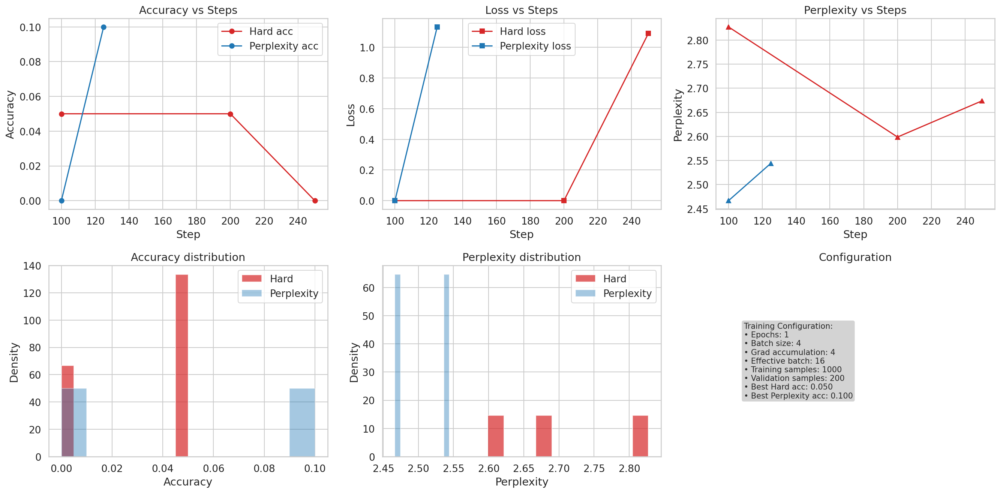

# Enhanced Reward Structure RL Comparison

## Configuration
- **Date:** 2025-08-25T23:39:50.473883
- **Dataset:** GSM8K (train/val split)  
- **Training Mode:** Full training
- **Epochs:** 1
- **Effective Batch Size:** 16
- **Training Samples:** 1000
- **Validation Samples:** 200

## Results
- **Hard reward final acc:** 0.000 (best: 0.050)
- **Perplexity reward final acc:** 0.100 (best: 0.100)
- **Winner (final):** Perplexity-based rewards
- **Winner (best):** Perplexity-based-based rewards
- **Improvement (percentage points):** 10.00

## Recommendation
Use perplexity-based reward: achieved best accuracy of 0.100. Perplexity rewards show smoother optimization.

## Performance Optimizations Applied
- ✅ larger effective batch size (16)
- ✅ reduced evaluation frequency (every 100 steps)
- ✅ disabled expensive checkpoint saving
- ✅ mixed-precision training (fp16/bfloat16)
- ✅ tensorFloat-32 acceleration
- ✅ model compilation for 10-15% speedup
- ✅ best model tracking

