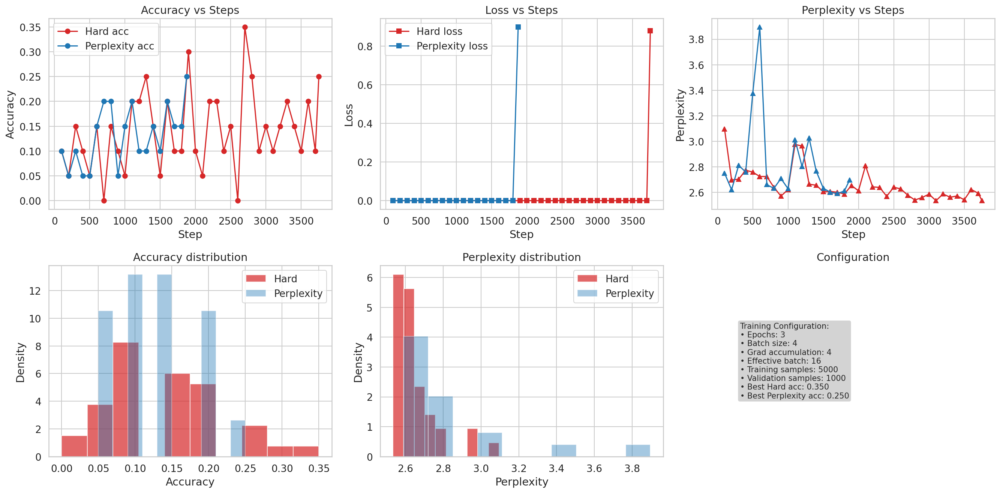

# Enhanced Reward Structure RL Comparison

## Configuration
- **Date:** 2025-08-27T02:24:12.445107
- **Dataset:** GSM8K (train/val split)  
- **Training Mode:** Full training
- **Epochs:** 3
- **Effective Batch Size:** 16
- **Training Samples:** 5000
- **Validation Samples:** 1000

## Results
- **Hard reward final acc:** 0.250 (best: 0.350)
- **Perplexity reward final acc:** 0.250 (best: 0.250)
- **Winner (final):** Hard (binary) rewards
- **Winner (best):** Hard-based rewards
- **Improvement (percentage points):** 0.00

## Recommendation
Use hard reward: achieved best accuracy of 0.350. Hard rewards converge faster to verifiable answers.

## Performance Optimizations Applied
- ✅ larger effective batch size (16)
- ✅ reduced evaluation frequency (every 100 steps)
- ✅ disabled expensive checkpoint saving
- ✅ mixed-precision training (fp16/bfloat16)
- ✅ tensorFloat-32 acceleration
- ✅ model compilation for 10-15% speedup
- ✅ best model tracking

